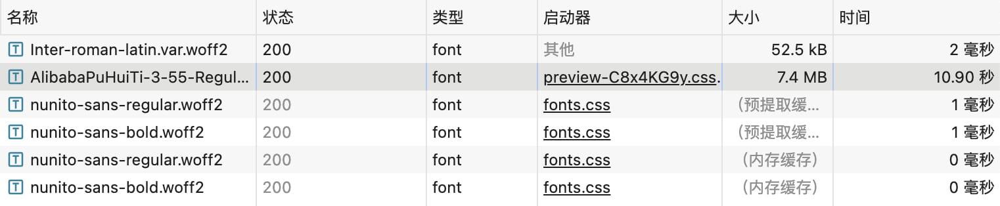
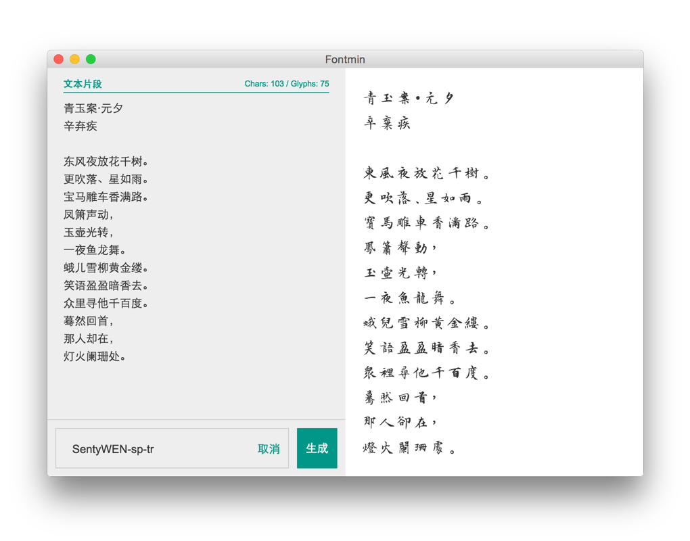
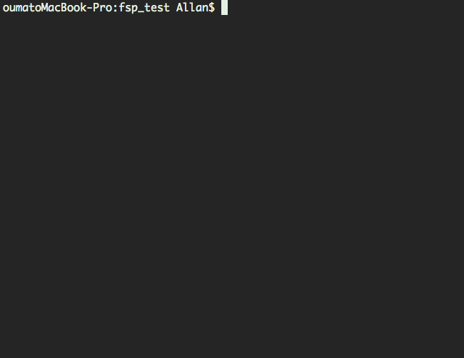
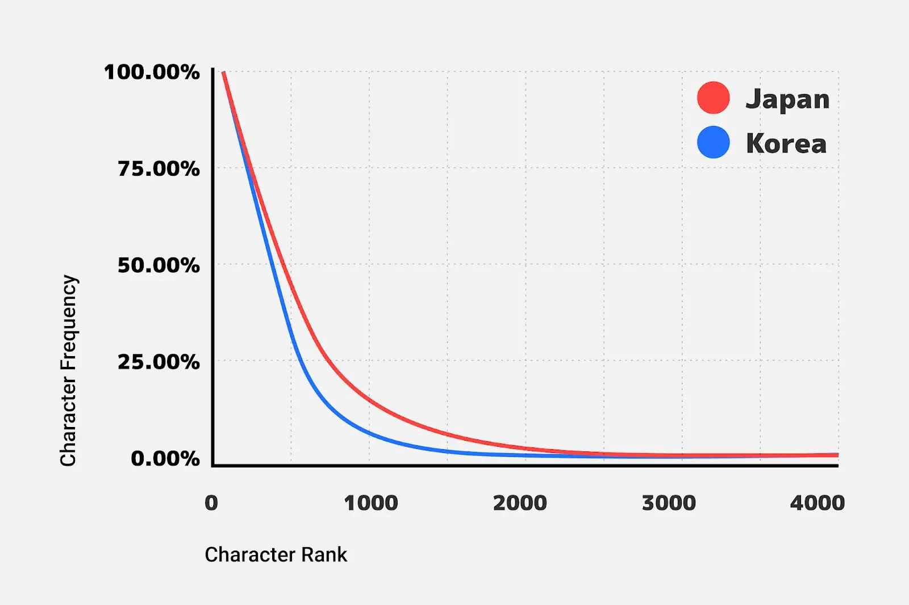
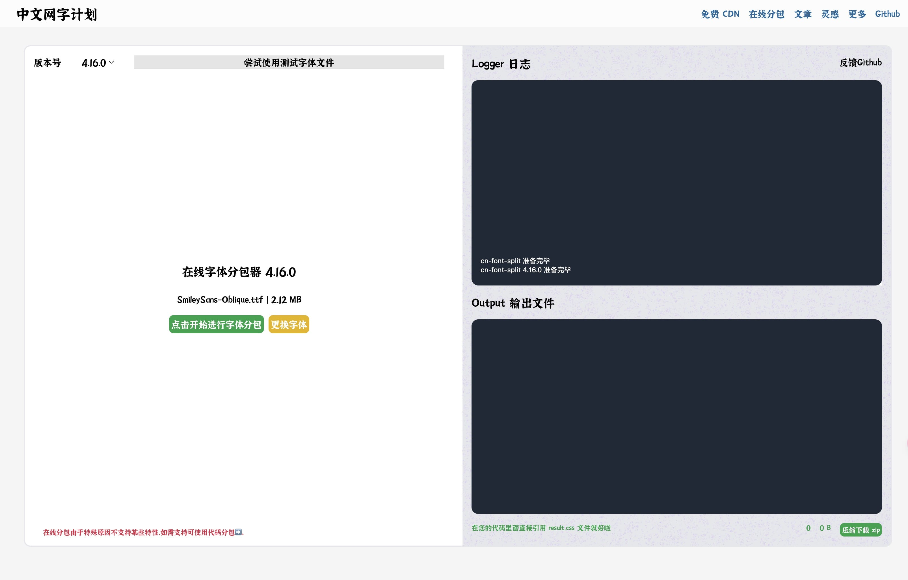
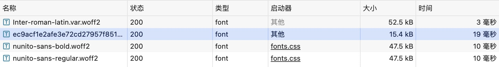

# 网页中文字体加载速度优化

在 Web 项目中，选择合适的字体能够显著提升用户体验。然而，由于中文字体文件通常较大，并且往往需要加载多种字重，如果无差别地加载所有字体文件，必然会导致加载时间过长，极大影响首屏显示速度。本文将简要介绍几种优化字体加载的方案，并讨论如何选择最合适的方案。


## 全量加载字体

> 全量加载字体的操作对首屏的性能影响比较大，因为加载完整的中文字体文件会耗费大量的时间和带宽。中文字体文件通常包含成千上万个字符，单个字体文件的大小可能在几 MB 到几十 MB 不等。加载这样的文件需要较长时间，特别是在网络状况不佳的情况下，会显著影响用户的首次内容展示（First Contentful Paint, FCP）和首次有意义的绘制（First Meaningful Paint, FMP）时间。

可以看到组件库使用的中文字体是 AlibabaPuHuiTi，这是阿里巴巴开发的免费商用字体，它有 7.4M，大大增加了首次加载网页的时间，达到了 10 秒，这个等待时间是不能接受的🤨。



<br />

::: details **为什么全量加载会影响性能**

1. **文件体积大：** 中文字体文件包括所有常用字符和一些稀有字符，总体积会非常庞大，通常超过几 MB。
2. **多种字重：** 如果需要加载多种字重的字体文件（比如常规体、加粗体、斜体等），每种字重都需要单独的文件，这进一步增加了加载时间。
3. **网络延迟：** 特别是对于移动设备和网络状况不佳的用户，加载大型字体文件会导致明显的延迟，影响页面的加载和用户体验。

:::

### 如何缓解全量加载的影响

虽然全量加载不是最优的字体加载策略，但有些情况下还是必须的。为减轻对首屏性能的影响，可以采用以下几种技巧：

1. **字体压缩：** 使用工具如 Font Squirrel 或 Font Forge 对字体文件进行压缩，减小其文件大小。
2. **字体格式：** 使用 WOFF2 格式的字体文件，它比 TTF、OTF 等传统格式更小、更现代化，加载速度更快。
3. **浏览器缓存：** 利用 HTTP 缓存策略（如 Cache-Control 和 Expires 头），确保字体文件在第一次加载后可以在后续访问中快速读取。
4. **预加载：** 使用 `<link rel="preload" href="path/to/font.woff2" as="font" type="font/woff2" crossorigin="anonymous">` 标签来预加载字体文件，优化加载顺序和时间。
5. **字体显示策略：** 使用 `font-display: swap` 或者 `font-display: optional` 来控制字体加载过程中文本的显示方式，确保在字体加载完成之前使用备用字体进行渲染，避免空白屏幕或不可见文本。

### 示例代码

以下是一个基本的示例，展示如何通过预加载和字体显示策略来优化全量加载字体：

```html
<head>
    <!-- 预加载字体 -->
    <link rel="preload" href="/fonts/AlibabaPuHuiTi.woff2" as="font" type="font/woff2" crossorigin="anonymous">
    <style>
        @font-face {
            font-family: 'AlibabaPuHuiTi';
            src: url('/fonts/AlibabaPuHuiTi.woff2') format('woff2');
            font-display: swap; /* 保证字体加载期间使用备用字体 */
        }
        body {
            font-family: 'AlibabaPuHuiTi', sans-serif;
        }
    </style>
</head>
```

通过这些优化技巧，可以在不得不使用全量加载字体的情况下，尽可能减少对首屏性能的负面影响。


## 部分加载字体

当你的文本内容相对固定时，可以使用部分加载的方案。例如，如果设计只想在某些地方使用特定字体中的数字，就可以只裁切出字体文件中的数字部分，只需加载几 KB 的字体即可。

### 字体子集

字体子集（Font Subset）是指从完整字体文件中提取出仅包含特定字符集的部分字体数据。完整的字体文件通常包含大量字符数据，但在网页设计中，我们可能只需要使用其中的一部分字符。

通过将需要使用的字符提取出来生成新的字体文件，可以显著减小字体文件的大小，从而提高下载速度和页面加载性能。

字体子集可以使用各种工具和服务来生成。这些工具会根据指定的字符集或文本内容，将字体文件中的字符提取出来，并生成只包括这些字符的新字体文件。因此，生成的字体文件体积更小，下载速度更快，提升了页面加载性能。

需要注意的是，字体子集法只适用于已知页面上将使用哪些字符的场景。如果页面上的文本是动态生成的或者包含用户输入，使用字体子集法可能不适用，因为无法预先确定所需的所有字符。

我们这里的优化没有采用字体子集法，因为无法确定页面上的具体文字内容（尽管有解决方法，但处理成本较高）。因此，我们选择了下文中的“[动态加载字体](./#动态加载字体)”方式来优化字体加载性能。

### 子集提取

利用工具如 [fontmini](https://ecomfe.github.io/fontmin/)、[字蛛](https://github.com/aui/font-spider/blob/master/README-ZH-CN.md)和 [subset-font](https://github.com/papandreou/subset-font) 等工具，可以从字体文件中提取所需的字符子集。通过这种方式，你可以创建尺寸更小的字体子集，从而优化网页加载性能。

#### Fontmin

使用 [Fontmini](https://ecomfe.github.io/fontmin/) 对使用到的文案进行选取，这样打包出来的字体文件就只会包含你选中的文案。



#### 字蛛+（Font-spider-Plus

[字蛛+（Font-spider-Plus）](https://github.com/allanguys/font-spider-plus) 是一个智能 WebFont 压缩工具，它能自动分析出本地页面和线上页面使用的 WebFont 并进行按需压缩。



## 动态加载字体 :star: <Badge type="tip" text="终极方案" />

这是一个终极方案，根据用户需求动态加载字体文件。根据页面中实际使用的字体，实时动态加载相应的字体文件。这种方法不受固定文案的限制，即使页面内容不断变更，也不会影响字体的展示。

### 字体分包

2017 年，Google Fonts 提出了切片字体，用于提高 CJK 字体的加载速度。自 2019 年后，切片字体已应用于所有 Noto Sans 网络字体。基于 Google Fonts 的切片字体字符集，我们可以自行生成切片字体来优化字体加载。

通过合理分包字体文件，可以显著减小单个字体文件的大小，进而有效提升网页字体加载速度。

#### 何为切片字体

由于 CJK（中日韩）字体包含的字符较多，其文件容量往往很大，这在 Web 使用中一直是一个较大的挑战。为了解决这个问题，Google Fonts 团队在 2018 年发表了一篇博文，提出了切片字体的方案。

团队首先从数以百万计的日语网页中收集了日文字符的使用频率数据，并进行了深入分析。



通过分析发现，字符使用频率可以明显分为两个部分：一部分是使用频率较高但字符较少的字符集，另一部分是使用频率较低但字符较多的字符集，即所谓的“长尾”。

基于此分析，团队采用了如下字符切片策略：

1. 将 2000 个最常用的字符放在一个切片中。
2. 将 1000 个次常用的字符放在另一个切片中。
3. 按 Unicode 编码对剩余字符进行分类，并将其分为 100 个大小相同的切片。

在实际应用中，用户在浏览网页时，只需下载页面上所需字符的切片。根据团队的统计结果，这种策略使下载的字节数比发送整个字体减少了 88%。

切片字体的核心功能依赖于 `unicode-range` 和 `woff2` 格式。`unicode-range` 用于在 `@font-face` 定义中指定特定字符范围，如果页面中未使用该范围内的字符，则不会下载相应的字体；而一旦使用至少一个字符，则会下载相应的字体切片。支持这两项功能的浏览器通常也支持 `HTTP/2`，后者可以实现多个小文件的同时传输，从而进一步优化加载速度。

> [!TIP]
> `unicode-range` 的用途可以看一下这篇文章 [CSS unicode-range特定字符使用font-face自定义字体](https://www.zhangxinxu.com/wordpress/2016/11/css-unicode-range-character-font-face/)

针对韩文字体，团队做了进一步的优化：

将 2000 个最常用的字符分为 20 个大小相同的切片。
按 Unicode 编码对剩余字符进行分类，并将其分为 100 个大小相同的切片。
这种策略使得下载的字节数比之前的最佳策略又减少了 38%。

最终，团队将这种切片字体策略应用到了 CJK 字体中，并针对不同语言调整了字符集大小和切片数量。


> [!IMPORTANT] 总结
> 简而言之，`unicode-range` 设置了 `@font-face` 定义的字体所应该应用的特定字符范围。如果页面中未使用该范围内的任何字符，则不会下载对应的字体；如果使用了，则仅下载包含相关字符的字体切片。这种方法大大提高了字体加载效率，尤其适用于像 CJK 这样字符数量庞大的语言。

### 如何分包字体文件

我们可以使用[中文网字计划](https://chinese-font.netlify.app/)开源的工具 [cn-font-split](https://github.com/KonghaYao/cn-font-split) 将庞大的字体包拆分为适合网络分发的版本。

::: details **中文网字计划**

- [字体分包插件 cn-font-split](https://github.com/KonghaYao/cn-font-split)
- [在线字体分包器](https://chinese-font.netlify.app/online-split/)
- [编译器插件 vite-plugin-font](https://www.npmjs.com/package/vite-plugin-font) 支持 Vite、Nuxt、Next、Webpack、Rspack，快速嵌入你的前端工具链

:::

我们直接使用[在线字体分包器](https://chinese-font.netlify.app/online-split/) 来处理: 



点击左侧选择字体文件，支持 SFNT (TrueType/OpenType), WOFF 或 WOFF2。

我们这里依然选择 `AlibabaPuHuiTi-3-55-Regular.otf` 文件。

<video src="./分包操作.mp4" controls="controls"></video>

上传字体文件后，在线字体分包器会自动处理并分包字体。可以看到日志记录，它显示总共有 `29,197` 个字符，被分为 `98` 个包。

```sh
...
TRACE 总字符数 29197
INFO 减少分包碎片 9 => 5
INFO <-- 180ms PreSubset Done
INFO --> Start
TRACE 开始分包 分包数 98
TRACE 序号 hb woff2 大小/字符 名称
TRACE 1 2ms 456ms 10.0 kB/186 d26a9e2
...
```

分包完毕后，点击右下角的 `压缩下载 zip` 按钮。最下载一个 `zip` 文件夹，解压后会得到很多文件。

```
AlibabaPuHuiTi-3-55-Regular
├─ 71102a9d710ef2cdb89c05cdd8ab8958.woff2
├─ ... // 很多字体分包，hash 命名
├─ index.html
├─ result.css
├─ reporter.json
```

这里每个 `woff2` 都是分包文件，且文件的大小在 `50-70KB` 左右。

::: details 它是怎么运行的？

[cn-font-split 的运行原理](https://chinese-font.netlify.app/post/cn_font_split_design/)

[字体分包性能优化](https://chinese-font.netlify.app/post/font_split_turbo/)

:::

### 分包成品目录解释

- **result.css**：CSS 入口文件，只需引入该 CSS 文件即可使用字体包。

- **woff2 字体**：经过 `cn-font-split` 优化后的字体分包文件，每个文件都是一个独立的字体分包，文件命名为 hash 值。

- **index.html**：用于展示打包分析报告，需开启一个服务端口进行查看。

- **reporter.json**：`cn-font-split` 的报告文件，其中包含 woff2 的分析和引用数据。

我们开启一个服务查看 `index.html` 中的字体分包报告，报告展示了字体的切片信息，我们滚动到页面底部，可以看到，每个切片的字符位数不同，越向顶部，字符字形越复杂。

```log
...
分片名称 88e330cd392df628359cf986cfe18771.woff2 | 分片大小 53.02 KB
鿕鿖鿗鿘鿙鿚鿛鿜鿝鿞鿟鿠鿡鿢鿣鿤鿥鿦鿧鿨鿩鿪鿫鿬鿭鿮鿯﨎﨏﨑﨓﨔﨟﨡﨣﨤﨧﨨﨩﹉﹊﹋﹌﹍﹎﹒﹟﹠﹡﹢﹣﹤﹥﹦﹨﹩﹪﹫＂＃＄％＆＇＊＋－．／０１２３４５６７８９＜＝＞＠ＡＢＣＤＥＦＧＨＩＪＫＬＭＮＯＰＱＲＳＴＵＶＷＸＹＺ［＼］＾｀ａｂｃｄｅｆｇｈｉｊｋｌｍｎｏｐｑｒｓｔｕｖｗｘｙｚ｜～￠￡￢￣￤￥‡‰ÌŤٶ೐᎚ᐓᗗ⦏㗋㲗㲘㸣䇾䧛䩽䫉唲啢喨廗戡撍晶杼歜氡翹萈虸蚕蟠證豇豏豑豔躙齾龃龌꟝ꣻꤗꨰꨶ꩘꾢넧넨넷넸뇭대덣덯덲덽됄됐됓둡듧듯듶듹딍딎딶떮떯떳뗧뗴똜똝똦똧똨똪똬뚕뚖뚭뛭랩럅럦럹럼렆렊렜뢸뫇뭟뭢뭼뮃받뵷붇뷷븩쀩쀪삩샊쇕쇙쇹쉼슈스쌗썛썡썤쒈쒔쒗앂옓옘옡옩옫올옭옯왂왊왋윬윯잟쟁쟽죙죞죡죳줇줊줝쨂쨎쩽쪩쬩쬭쬮쬱쬸쬹쬻쬿쭁쭊쭎쭚쭛쭤쭩쭬쭯쭳쭶쭸쭼쮱쮿쯀쯎챖챟쳵쳶쳽쳿촂촃촊춋춍춏춐춟춠춨춭춮췕츘츚츣츦츪칼캈캓

分片名称 ccb6436595456112435f6a82a08ad341.woff2 | 分片大小 53.32 KB
黋黌黐黒黓黕黖黗黙黚點黡黣黤黦黨黫黬黭黮黰黱黲黳黴黵黶黷黸黺黽黿鼀鼁鼂鼃鼄鼅鼆鼇鼈鼉鼊鼌鼏鼑鼒鼔鼕鼖鼘鼚鼛鼜鼝鼞鼟鼡鼣鼤鼥鼦鼧鼨鼩鼪鼫鼭鼮鼰鼱鼲鼳鼴鼵鼶鼸鼺鼼鼿齀齁齂齃齅齆齇齈齉齊齋齌齍齎齏齒齓齔齕齖齗齘齙齚齛齜齝齞齟齠齡齢齣齤齥齦齧齨齩齪齫齬齭齮齯齰齱齲齳齴齵齶齷齸齹齺齻齼齽齾龁龂龍龎龏龐龑龒龓龔龕龖龗龘龜龝龞龡龢龣龤龥龦龧龨龩龪龫龬龭龮龯龰龱龲龳龴龵龶龷龸龹龺龻龼龽龾龿鿀鿁鿂鿃鿄鿅鿆鿇鿈鿉鿊鿋鿌鿍鿎鿏鿐鿑鿒鿓鿔

分片名称 04b6a4ae52fc3698f1943c024ea9658f.woff2 | 分片大小 54.41 KB
鳒鳚鳛鳠鳡鳣鳤鳥鳦鳧鳨鳩鳪鳫鳬鳭鳮鳯鳰鳱鳲鳳鳴鳵鳶鳷鳸鳹鳺鳻鳼鳽鳾鳿鴀鴁鴂鴃鴄鴅鴆鴇鴈鴉鴊鴋鴌鴍鴎鴏鴐鴑鴒鴓鴔鴕鴖鴗鴘鴙鴚鴛鴜鴝鴞鴟鴠鴡鴢鴣鴤鴥鴦鴧鴨鴩鴪鴫鴬鴭鴮鴯鴰鴱鴲鴳鴴鴵鴶鴷鴸鴹鴺鴻鴼鴽鴾鴿鵀鵁鵂鵃鵄鵅鵆鵇鵈鵉鵊鵋鵌鵍鵎鵏鵐鵑鵒鵓鵔鵕鵖鵗鵘鵙鵚鵛鵜鵝鵞鵟鵠鵡鵢鵣鵤鵥鵦鵧鵨鵩鵪鵫鵬鵭鵮鵯鵰鵱鵲鵳鵴鵵鵶鵷鵸鵹鵺鵻鵼鵽鵾鵿鶀鶁鶂鶃鶄鶅鶆鶇鶈鶉鶊鶋鶌鶍鶎鶏鶐鶑鶒鶓鶔鶕鶖鶗鶘鶙鶚鶛鶜鶝鶞鶟鶠鶡鶢鶣鶤鶥鶦鶧鶨鶩鶪鶫鶬鶭鶮鶯鶰鶱鶲鶳鶴鶵鶶鶷鶸鶹鶺

分片名称 a49d2923fae486651207b5c6966d2222.woff2 | 分片大小 55.65 KB
髙髚髛髜髝髞髠髢髣髤髥髧髨髩髪髬髮髰髱髲髳髴髵髶髷髸髺髼髽髾髿鬀鬁鬂鬄鬅鬆鬇鬉鬊鬋鬌鬍鬎鬐鬑鬒鬔鬕鬖鬗鬘鬙鬚鬛鬜鬝鬞鬠鬡鬢鬤鬥鬦鬧鬨鬩鬪鬫鬬鬭鬮鬰鬱鬳鬴鬵鬶鬷鬸鬹鬺鬽鬾鬿魀魆魊魋魌魎魐魒魓魕魖魗魘魙魚魛魜魝魞魟魠魡魢魣魤魥魦魧魨魩魪魫魬魭魮魯魰魱魲魳魴魵魶魷魸魹魺魻魼魽魾魿鮀鮁鮂鮃鮄鮅鮆鮇鮈鮉鮊鮋鮌鮍鮎鮏鮐鮑鮒鮓鮔鮕鮖鮗鮘鮙鮚鮛鮜鮝鮞鮟鮠鮡鮢鮣鮤鮥鮦鮧鮨鮩鮪鮫鮬鮭鮮鮯鮰鮱鮲鮳鮴鮵鮶鮷鮸鮹鮺鮻鮼鮽鮾鮿鯀鯁鯂鯃鯄鯅鯆鯇鯈鯉鯊鯋鯌鯍鯎鯏鯐鯑鯒鯓鯔鯕鯖鯗
...
```

使用编辑器查看 `result.css` 可以看到有很多的 `@font-face` 规则。这些规则定义了每个字体分包的加载和使用方式。每一个 `@font-face` 规则都有一个 `unicode-range` 属性，用以指定该字体分包所包含的字符 `Unicode` 码点范围。

```css
...
@font-face {font-family: "Alibaba PuHuiTi 3.0 55 Regular";src:local("Alibaba PuHuiTi 3.0 55 Regular"),url("./88e330cd392df628359cf986cfe18771.woff2") format("woff2");font-style: normal;font-weight: 400;font-display: swap;unicode-range:U+9fd5-9fef,U+fa0e-fa0f,U+fa11,U+fa13-fa14,U+fa1f,U+fa21,U+fa23-fa24,U+fa27-fa29,U+fe49-fe4e,U+fe52,U+fe5f-fe66,U+fe68-fe6b,U+ff02-ff07,U+ff0a-ff0b,U+ff0d-ff19,U+ff1c-ff1e,U+ff20-ff3e,U+ff40-ff5a,U+ff5c,U+ff5e,U+ffe0-ffe5,U+20087,U+20089,U+200cc,U+20164,U+20676,U+20cd0,U+2139a,U+21413,U+215d7,U+2298f,U+235cb,U+23c97-23c98,U+23e23,U+241fe,U+249db,U+24a7d,U+24ac9,U+25532,U+25562,U+255a8,U+25ed7,U+26221,U+2648d,U+26676,U+2677c,U+26b5c,U+26c21,U+27ff9,U+28408,U+28678,U+28695,U+287e0,U+28b49,U+28c47,U+28c4f,U+28c51,U+28c54,U+28e99,U+29f7e,U+29f83,U+29f8c,U+2a7dd,U+2a8fb,U+2a917,U+2aa30,U+2aa36,U+2aa58,U+2afa2,U+2b127-2b128,U+2b137-2b138,U+2b1ed,U+2b300,U+2b363,U+2b36f,U+2b372,U+2b37d,U+2b404,U+2b410,U+2b413,U+2b461,U+2b4e7,U+2b4ef,U+2b4f6,U+2b4f9,U+2b50d-2b50e,U+2b536,U+2b5ae-2b5af,U+2b5b3,U+2b5e7,U+2b5f4,U+2b61c-2b61d,U+2b626-2b628,U+2b62a,U+2b62c,U+2b695-2b696,U+2b6ad,U+2b6ed,U+2b7a9,U+2b7c5,U+2b7e6,U+2b7f9,U+2b7fc,U+2b806,U+2b80a,U+2b81c,U+2b8b8,U+2bac7,U+2bb5f,U+2bb62,U+2bb7c,U+2bb83,U+2bc1b,U+2bd77,U+2bd87,U+2bdf7,U+2be29,U+2c029-2c02a,U+2c0a9,U+2c0ca,U+2c1d5,U+2c1d9,U+2c1f9,U+2c27c,U+2c288,U+2c2a4,U+2c317,U+2c35b,U+2c361,U+2c364,U+2c488,U+2c494,U+2c497,U+2c542,U+2c613,U+2c618,U+2c621,U+2c629,U+2c62b-2c62d,U+2c62f,U+2c642,U+2c64a-2c64b,U+2c72c,U+2c72f,U+2c79f,U+2c7c1,U+2c7fd,U+2c8d9,U+2c8de,U+2c8e1,U+2c8f3,U+2c907,U+2c90a,U+2c91d,U+2ca02,U+2ca0e,U+2ca7d,U+2caa9,U+2cb29,U+2cb2d-2cb2e,U+2cb31,U+2cb38-2cb39,U+2cb3b,U+2cb3f,U+2cb41,U+2cb4a,U+2cb4e,U+2cb5a-2cb5b,U+2cb64,U+2cb69,U+2cb6c,U+2cb6f,U+2cb73,U+2cb76,U+2cb78,U+2cb7c,U+2cbb1,U+2cbbf-2cbc0,U+2cbce,U+2cc56,U+2cc5f,U+2ccf5-2ccf6,U+2ccfd,U+2ccff,U+2cd02-2cd03,U+2cd0a,U+2cd8b,U+2cd8d,U+2cd8f-2cd90,U+2cd9f-2cda0,U+2cda8,U+2cdad-2cdae,U+2cdd5,U+2ce18,U+2ce1a,U+2ce23,U+2ce26,U+2ce2a,U+2ce7c,U+2ce88,U+2ce93;}
@font-face {font-family: "Alibaba PuHuiTi 3.0 55 Regular";src:local("Alibaba PuHuiTi 3.0 55 Regular"),url("./ccb6436595456112435f6a82a08ad341.woff2") format("woff2");font-style: normal;font-weight: 400;font-display: swap;unicode-range:U+9ecb-9ecc,U+9ed0,U+9ed2-9ed3,U+9ed5-9ed7,U+9ed9-9eda,U+9ede,U+9ee1,U+9ee3-9ee4,U+9ee6,U+9ee8,U+9eeb-9eee,U+9ef0-9ef8,U+9efa,U+9efd,U+9eff-9f0a,U+9f0c,U+9f0f,U+9f11-9f12,U+9f14-9f16,U+9f18,U+9f1a-9f1f,U+9f21,U+9f23-9f2b,U+9f2d-9f2e,U+9f30-9f36,U+9f38,U+9f3a,U+9f3c,U+9f3f-9f43,U+9f45-9f4f,U+9f52-9f7e,U+9f81-9f82,U+9f8d-9f98,U+9f9c-9f9e,U+9fa1-9fd4;}
@font-face {font-family: "Alibaba PuHuiTi 3.0 55 Regular";src:local("Alibaba PuHuiTi 3.0 55 Regular"),url("./04b6a4ae52fc3698f1943c024ea9658f.woff2") format("woff2");font-style: normal;font-weight: 400;font-display: swap;unicode-range:U+9cd2,U+9cda-9cdb,U+9ce0-9ce1,U+9ce3-9dba;}
@font-face {font-family: "Alibaba PuHuiTi 3.0 55 Regular";src:local("Alibaba PuHuiTi 3.0 55 Regular"),url("./a49d2923fae486651207b5c6966d2222.woff2") format("woff2");font-style: normal;font-weight: 400;font-display: swap;unicode-range:U+9ad9-9ade,U+9ae0,U+9ae2-9ae5,U+9ae7-9aea,U+9aec,U+9aee,U+9af0-9af8,U+9afa,U+9afc-9b02,U+9b04-9b07,U+9b09-9b0e,U+9b10-9b12,U+9b14-9b1e,U+9b20-9b22,U+9b24-9b2e,U+9b30-9b31,U+9b33-9b3a,U+9b3d-9b40,U+9b46,U+9b4a-9b4c,U+9b4e,U+9b50,U+9b52-9b53,U+9b55-9bd7;}
@font-face {font-family: "Alibaba PuHuiTi 3.0 55 Regular";src:local("Alibaba PuHuiTi 3.0 55 Regular"),url("./71102a9d710ef2cdb89c05cdd8ab8958.woff2") format("woff2");font-style: normal;font-weight: 400;font-display: swap;unicode-range:U+99b9-9a6b,U+9a72,U+9a83,U+9a89,U+9a8d-9a8e,U+9a94-9a95,U+9a99,U+9aa6,U+9aa9-9aaf,U+9ab2-9ab5,U+9ab9,U+9abb,U+9abd-9abf,U+9ac3-9ac4,U+9ac6-9aca,U+9acd-9ad0,U+9ad2,U+9ad4-9ad7;}
...
```

### 使用分包

接下来我们在项目中使用分包后的字体，将字体文件放到 CDN 服务或者直接放在项目的静态目录下，然后在 `css` 之中直接引入 `result.css`

```css
@import url('/public/font/AlibabaPuHuiTi-3-55-Regular/result.css');
* {
  font-family: 'Alibaba PuHuiTi 3.0 55 Regular', sans-serif;
}
```

做完这些步骤后，网页字体就已经实现了动态加载，可以看到首次加载时间从 10 秒减少到了 19 毫秒，显著优化了页面加载性能 🎉。



<style scoped>
h2{
  display: flex;
  align-items: center;
  gap: 0.25rem;
}
</style>