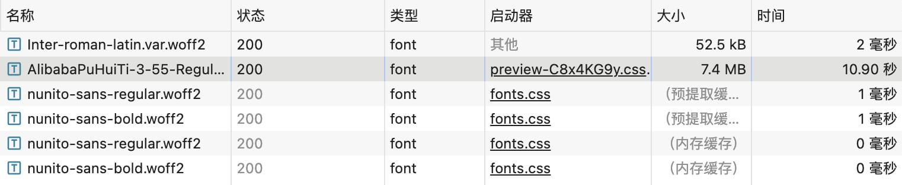

# 网页中文字体加载速度优化

在 Web 项目中，选择合适的字体能够显著提升用户体验。然而，由于中文字体文件通常较大，并且往往需要加载多种字重，如果无差别地加载所有字体文件，必然会导致加载时间过长，极大影响首屏显示速度。本文将简要介绍几种优化字体加载的方案，并讨论如何选择最合适的方案。

## 全量加载字体

> 全量加载字体的操作对首屏的性能影响比较大，因为加载完整的中文字体文件会耗费大量的时间和带宽。中文字体文件通常包含成千上万个字符，单个字体文件的大小可能在几 MB 到几十 MB 不等。加载这样的文件需要较长时间，特别是在网络状况不佳的情况下，会显著影响用户的首次内容展示（First Contentful Paint, FCP）和首次有意义的绘制（First Meaningful Paint, FMP）时间。

可以看到组件库使用的中文字体是 AlibabaPuHuiTi，这是阿里巴巴开发的免费商用字体，它有 7.4M，大大增加了首次加载网页的时间，达到了 10 秒，这个等待时间是不能接受的🤨。

 

::: details **为什么全量加载会影响性能**

1. **文件体积大：** 中文字体文件包括所有常用字符和一些稀有字符，总体积会非常庞大，通常超过几 MB。
2. **多种字重：** 如果需要加载多种字重的字体文件（比如常规体、加粗体、斜体等），每种字重都需要单独的文件，这进一步增加了加载时间。
3. **网络延迟：** 特别是对于移动设备和网络状况不佳的用户，加载大型字体文件会导致明显的延迟，影响页面的加载和用户体验。

:::
